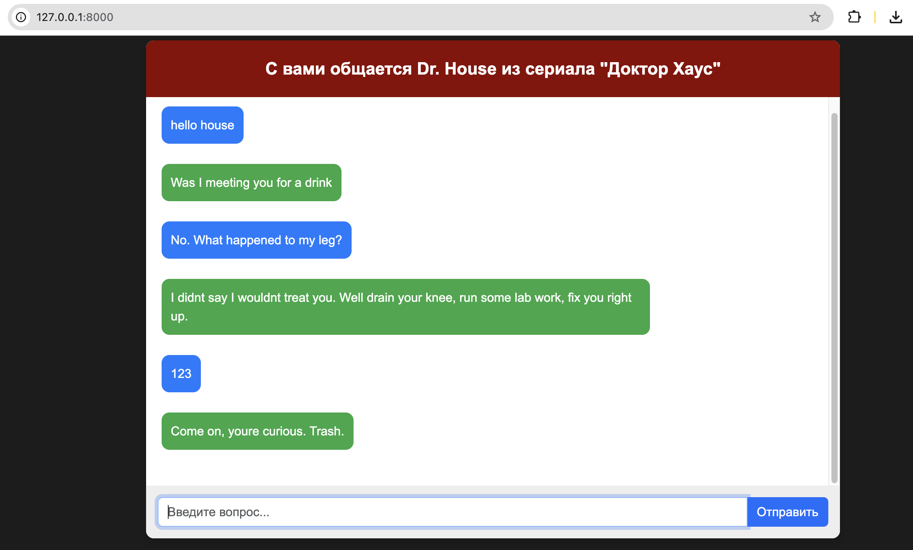

# ChatBot Dr. House

Чат-бот, который отвечает в стиле Доктора Хауса, используя **retrieval-based** подход с биэнкодером и кросс-энкодером для ранжирования ответов.  

Проект включает предобработку данных, обучение моделей, инференс и веб-сервис на FastAPI.

### 🔬 Сложность персонажа: Доктор Хаус

Доктор Хаус — **циничный, интеллектуальный и саркастичный** персонаж, чьи ответы часто содержат **иронию, медицинские термины и жесткие шутки**.  
Одной из главных сложностей проекта стало **низкое векторное сходство** его реплик с традиционными ответами в диалогах.  

В ходе экспериментов обнаружилось:  
- **Косинусное сходство** реплик Хауса с обычными ответами **в среднем 0.21**, что крайне низко.  
- Использование **общих диалоговых моделей** давало слишком "мягкие" ответы, теряя стиль персонажа.  
- **Выбор негативных примеров** критично влиял на качество финальной модели.  

Для решения этих проблем:  
- Данные антагонистов **увеличены до 160 тыс. реплик** для лучшего контраста.  
- Отфильтрованы **слишком простые негативные примеры**, улучшив обобщение модели.  
- Оптимизирован процесс ранжирования ответов через кросс-энкодер.  

## 📌 Используемые датасеты

### Основные данные
Скрипты диалогов из различных сериалов использовались для разделения на **героя** (Доктор Хаус) и **антигероев** (другие персонажи). Данные загружены с **Kaggle** и **Hugging Face**:

- **Доктор Хаус**: [Kaggle](https://www.kaggle.com/datasets/milozampari/house-md)
- **Антагонисты**:
  - [Game of Thrones](https://www.kaggle.com/datasets/gopinath15/gameofthrones)
  - [Breaking Bad](https://www.kaggle.com/datasets/mexwell/breakingbad-script)
  - [Futurama](https://www.kaggle.com/datasets/arianmahin/the-futurama-dataset)
  - [Attack on Titan (Eren Jaeger)](https://www.kaggle.com/datasets/gauriket/erenjeager)
  - [The Office](https://www.kaggle.com/datasets/vkaul3/the-office-entire-script-for-nlp-applications)
  - [Star Wars](https://www.kaggle.com/datasets/xvivancos/star-wars-movie-scripts)
  - [Rick & Morty](https://www.kaggle.com/datasets/andradaolteanu/rickmorty-scripts)
  - [Friends](https://www.kaggle.com/datasets/blessondensil294/friends-tv-series-screenplay-script)
  - [The Big Bang Theory](https://www.kaggle.com/datasets/mitramir5/the-big-bang-theory-series-transcript)
  - [SpongeBob](https://huggingface.co/datasets/krplt/spongebob_transcripts)

---

## 🔹 Подготовка данных

### **1. Объединение датасетов**
Все данные приведены к единому формату CSV:
- **house_final_cleaned.csv** – реплики Доктора Хауса
- **antagonists_final_cleaned.csv** – реплики антагонистов

### **2. Очистка и фильтрация**
- Удалены ненужные символы и пробелы
- Фильтрация коротких реплик (<10 символов)
- Разбиение длинных реплик на чанки (до 30 слов)
- Исключение дубликатов

**Файлы данных:**  
- `house_extended_cleaned.csv` – реплики Доктора Хауса  
- `house_lines_with_context.csv` – контекстные диалоги Хауса  
- `all_series_cleaned.csv` – реплики антагонистов из разных сериалов  
- `cleaned_triplet_data.csv` – финальные триплеты для биэнкодера  
- `reranker_extended.csv` – данные для кросс-энкодера  

### **3. Генерация триплетов**
Создан датасет **house_triplets.pkl**, содержащий:
- **Анкер** (вопрос или реплика)
- **Позитивный ответ** (реплика Доктора Хауса)
- **Негативный ответ** (реплика антагонистов, семантически отличающаяся)

---

### 🏋️ Обучение моделей

### **1. Обучение биэнкодера**
Использовалась модель **distilroberta-base**, дообученная на триплетах:
- **Transformer** – энкодер  
- **Pooling** – агрегация эмбеддингов  
- **Triplet Loss** – функция потерь  

#### **Процесс обучения**
- Разделение данных: **train (85%) / validation (15%)**  
- **16 эпох**, batch_size=32  
- **Learning rate = 3e-6**  
- Проверка качества на валидации  

#### **Результаты**
Показатель **cosine similarity**:
- **До обучения**: ~0.21  
- **После обучения**: **~0.85**  

### **2. Обучение кросс-энкодера**
Использовалась модель **microsoft/deberta-v3-base**, дообученная на кросс-энкодерном датасете:
- На вход передаются пары **(вопрос, ответ)**  
- Модель предсказывает **релевантность ответа**  
- Функция потерь: **Binary Cross-Entropy**  

#### **Результаты**
- **Accuracy**: **93.1%** на валидации  
- **F1-score**: **93.1%**  
- Улучшенная генерация ответов в стиле персонажа  

## 🚀 Инференс

### **1. Поиск кандидатов (биэнкодер)**
Используется **inference_biencoder.py**
- Загружается **предобученный биэнкодер**
- Находится **TOP-K** релевантных ответов

python models/inference_biencoder.py --query "When will i feel better?"

{"response": "Take your time. Well continue with the medicine."}

2. Ранжирование (кросс-энкодер)
Используется inference_crossencoder.py

Берет TOP-K кандидатов
Ранжирует их
Выдает лучший ответ

3. Ускоренный инференс
Используется inference_biencoder_fasten.py

Применяет FAISS для быстрого поиска
Ускоряет инференс в ~6 раз

🎛 Веб-интерфейс (FastAPI)

1. Запуск сервера
Чат-бот реализован на FastAPI, UI – на Jinja2

2. Вызов API
curl -X 'POST' \
  'http://127.0.0.1:8000/chat' \
  -H 'Content-Type: application/json' \
  -d '{"text": "hello house?"}'

  📁 Структура проекта

 ## 📁 Структура проекта

chat_bot_dr.house/ │── app/ │ ├── init.py # Инициализация модуля │ ├── chatbot.py # Логика бота │ ├── main.py # FastAPI сервер │ ├── utils.py # Вспомогательные функции │── checkpoints/ │ ├── model/ # Сохраненные модели │── data/ │ ├── all_series_cleaned.csv # Очищенные реплики из всех сериалов │ ├── cleaned_triplet_data.csv # Финальные триплеты для биэнкодера │ ├── cross_encoder_data_limited_*.csv # Данные для кросс-энкодера (подбор негативных примеров с ограничением 0.1-0.18) │ ├── house_extended_cleaned.csv # Реплики Доктора Хауса (расширенный датасет) │ ├── house_lines_with_context.csv # Контекстные диалоги Хауса │ ├── reranker_extended.csv # Расширенные данные для ранжирования │ ├── reranker_limited_cos.pkl # Датасет ранжирования (подбор негативных примеров с ограничением 0.1-0.18) │ ├── triplet_extended_data.csv # Расширенный датасет триплетов │ ├── triplet_limited_cos.csv # Датасет триплетов (подбор негативных примеров с ограничением 0.1-0.18) │ ├── triplets_extended.pkl # Полный расширенный датасет триплетов │ ├── triplets_limited_cos_extended.pkl # Датасет триплетов (подбор негативных примеров с ограничением 0.1-0.18) │── data_old/ # Архив старых версий датасетов │── data_preparation/ │ ├── data_preparing_v2.ipynb # Последняя версия подготовки данных │ ├── data_for_cross_encoder_preparing.ipynb # Подготовка данных для кросс-энкодера │ ├── data_preparation_for_biencoder.ipynb # Подготовка данных для биэнкодера │ ├── datasets_merging.py # Объединение датасетов │── logs/ │ ├── latest-run/ # Логи последнего запуска │ ├── logs_v2.zip # Архив логов │── models/ │ ├── bi_encoder_training_v2_0_simple.ipynb # Обучение биэнкодера (v2, новая версия) │ ├── bi_encoder_training.ipynb # Обычное обучение биэнкодера │ ├── biencoder_model_v2.0.zip # Последняя версия обученного биэнкодера │ ├── cross_encoder_training_v2.ipynb # Обучение кросс-энкодера (v2, новая версия) │ ├── cross_encoder_training.ipynb # Обычное обучение кросс-энкодера │ ├── inference_comparison.ipynb - сравнение и выводы по обычному и ускоренному инференсу моделей.│ ├── inference_biencoder.py # Обычный инференс биэнкодера │ ├── inference_biencoder_fasten.py # Ускоренный инференс биэнкодера (FAISS) │ ├── inference_crossencoder.py # Инференс кросс-энкодера │── static/ │ ├── Screenshot.png # Скриншот работы бота │ ├── style.css # Стили для веб-интерфейса │── templates/ │ ├── index.html # HTML-интерфейс │── venv/ # Виртуальное окружение │── .gitignore # Исключенные файлы Git │── README.md # Описание проекта │── requirements.txt # Зависимости проекта

⚡ Оптимизация инференса
Использован FAISS для быстрого поиска ближайших эмбеддингов
Предварительное кэширование эмбеддингов ответов
Оптимизирована обработка запросов

🔧 Установка и запуск

# Установка зависимостей
pip install -r requirements.txt

# Запуск сервера
uvicorn app.main:app --reload

📝 Итог
Чат-бот Доктора Хауса создан с использованием retrieval-based подхода. Были проведены: ✅ Очистка данных
✅ Генерация триплетов
✅ Обучение моделей
✅ Оптимизация инференса
✅ Реализация API и веб-интерфейса

Проект полностью соответствует требованиям и готов к использованию. 
